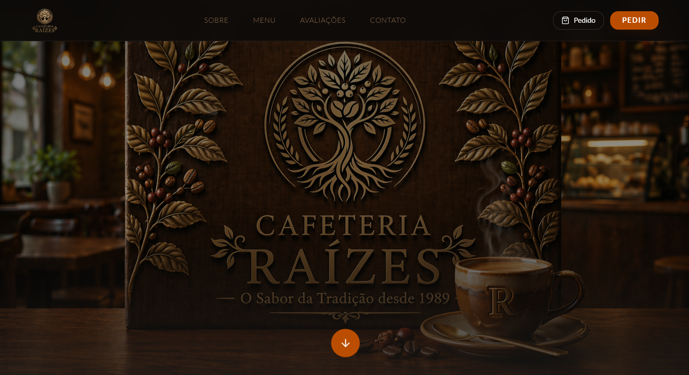
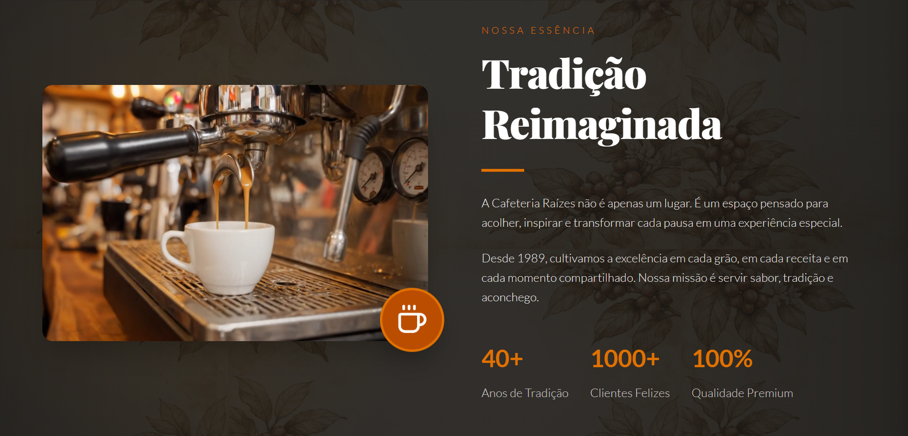
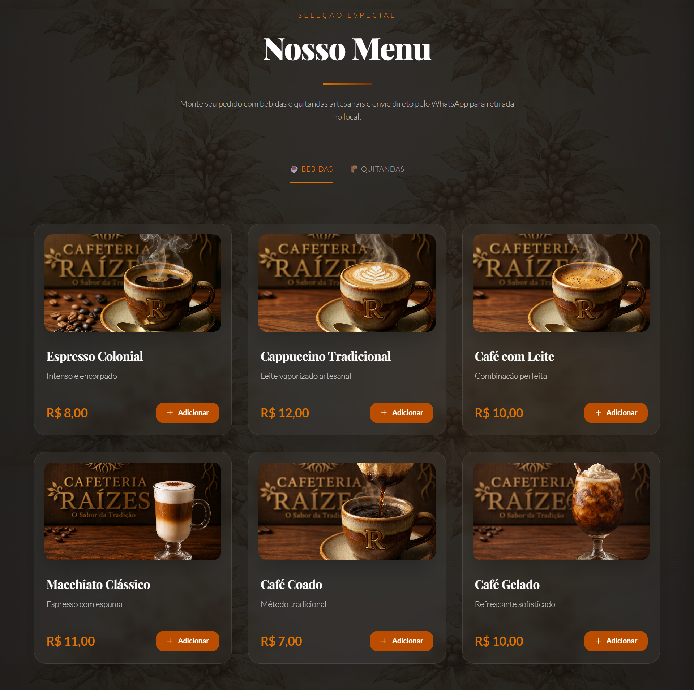
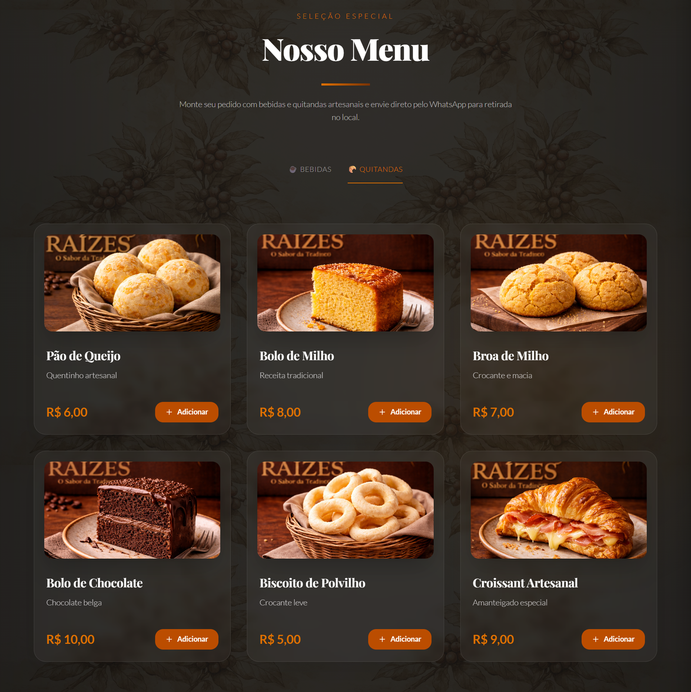
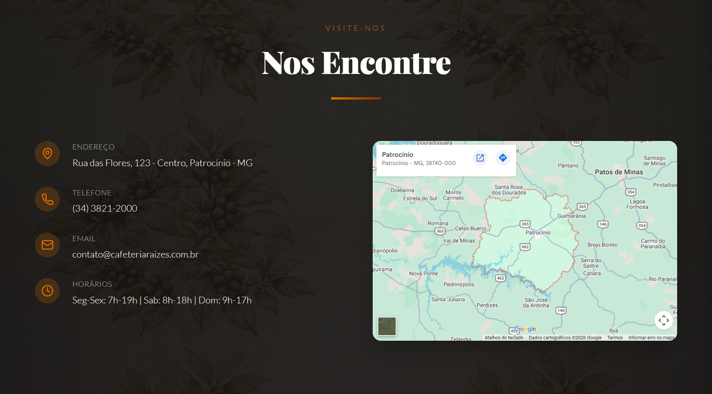

# ☕ Cafeteria Raízes - Sabor e Tradição

Aplicação web institucional para a Cafeteria Raízes, com design colonial mineiro, cardápio interativo, avaliações de clientes e localização integrada. O projeto foi limpo e reorganizado para funcionar como uma landing page moderna, leve e sem dependências geradas por ferramentas externas.

## 🌐 Acesse o Projeto

👉 https://cafeteria-colonial-livid.vercel.app/

## 📌 Objetivo do Projeto

Este projeto foi desenvolvido com o objetivo de praticar e demonstrar habilidades em desenvolvimento front-end moderno, incluindo:

- construção de interfaces sofisticadas e responsivas com design colonial;
- desenvolvimento com React 19 e TypeScript;
- organização de componentes por responsabilidade;
- separação entre dados, layout e seções da página;
- estilização com Tailwind CSS 4;
- integração de imagens, vídeo e mapa;
- foco em UX/UI aplicado a negócios reais;
- estrutura limpa para manutenção e evolução futura.

## 🚀 Funcionalidades

- 🏛️ Design colonial sofisticado com paleta inspirada em café;
- 📹 seção Sobre com vídeo institucional em destaque;
- ☕ cardápio interativo com abas para Bebidas e Quitandas;
- ⭐ avaliações de clientes com carrossel automático simples;
- 📍 mapa integrado via Google Maps embed;
- 🎯 header fixo com navegação por âncoras;
- 📱 layout responsivo para desktop, tablet e mobile;
- 🧹 estrutura limpa, sem código de ferramenta externa e sem arquivos gerados no repositório.

## 🛠️ Tecnologias Utilizadas

- React 19
- TypeScript
- Vite
- Tailwind CSS 4
- Lucide React
- shadcn/ui somente para o componente Button

## 🏗️ Estrutura do Projeto

```text
cafeteria-colonial/
│
├── client/
│   ├── public/
│   │   ├── images/
│   │   │   ├── menu/
│   │   │   └── telas/
│   │   └── video/
│   │
│   ├── src/
│   │   ├── components/
│   │   │   ├── layout/          # Header e Footer
│   │   │   ├── sections/        # Seções principais da landing page
│   │   │   └── ui/              # Componentes básicos reaproveitáveis
│   │   ├── data/                # Dados do menu e avaliações
│   │   ├── lib/                 # Funções utilitárias
│   │   ├── pages/               # Página principal
│   │   ├── App.tsx
│   │   ├── main.tsx
│   │   └── index.css
│   │
│   └── index.html
│
├── components.json
├── package.json
├── package-lock.json
├── tsconfig.json
├── tsconfig.node.json
├── vite.config.ts
├── LICENSE
└── README.md
```

## ⚙️ Organização da Aplicação

A aplicação foi reorganizada para reduzir acoplamento e facilitar manutenção:

- `components/layout`: componentes estruturais, como Header e Footer;
- `components/sections`: seções da página, como Hero, Sobre, Menu, Avaliações e Contato;
- `components/ui`: componentes de interface realmente utilizados;
- `data`: conteúdo estático separado dos componentes visuais;
- `pages`: montagem da página principal;
- `lib`: utilitários compartilhados.

## ⭐ Diferenciais Técnicos

- Remoção completa de códigos, plugins, rotas e arquivos gerados por ferramenta externa;
- Remoção de `server`, `shared`, `.webdev`, `dist`, `node_modules` e arquivos não utilizados;
- Simplificação do Vite para um projeto front-end puro;
- Redução de dependências para manter somente o necessário;
- Componentização da Home em seções menores;
- Dados do cardápio e avaliações separados da UI;
- Meta tags de SEO e Open Graph adicionadas no `index.html`;
- Imagens do menu com `width` e `height` definidos para reduzir layout shift.

## 📸 Interface do Sistema

### 📱 Interface Completa

<p align="center">
  
</p>

### 🏠 Página Inicial - Hero Section

<p align="center">
  
</p>

### ☕ Seção Sobre

<p align="center">
  
</p>

### 🍵 Menu - Bebidas

<p align="center">
  
</p>

### 🥐 Menu - Quitandas

<p align="center">
  
</p>

### ⭐ Avaliações

<p align="center">
  
</p>

### 📍 Localização

<p align="center">
  
</p>

## ▶️ Como Executar o Projeto

### 1. Clonar o repositório

```bash
git clone https://github.com/felipe-frc/cafeteria-colonial.git
```

### 2. Acessar a pasta do projeto

```bash
cd cafeteria-colonial
```

### 3. Instalar dependências

```bash
npm install
```

### 4. Executar em desenvolvimento

```bash
npm run dev
```

### 5. Validar TypeScript

```bash
npm run check
```

### 6. Gerar build de produção

```bash
npm run build
```

### 7. Visualizar build localmente

```bash
npm run preview
```

## ⚠️ Observações

- O mapa usa embed público do Google Maps, sem necessidade de chave de API;
- As imagens e o vídeo estão dentro de `client/public`;
- A pasta `dist` é gerada automaticamente pelo Vite e não deve ser versionada;
- A pasta `node_modules` não deve ser enviada para o GitHub;
- O projeto foi simplificado para funcionar como front-end estático na Vercel.

## 🧠 Decisões de Desenvolvimento

Durante a limpeza estrutural, foram adotadas as seguintes decisões:

- Manter o projeto como landing page front-end pura;
- Remover servidor Express porque não era necessário para o deploy estático;
- Remover roteamento porque o projeto possui uma única página;
- Remover componentes shadcn/ui não utilizados;
- Remover dependências sem uso direto no código;
- Separar conteúdo estático em arquivos de dados;
- Priorizar uma estrutura simples, previsível e fácil de explicar em entrevista.

## 📈 Melhorias Futuras

- 📧 Formulário de contato funcional;
- 🖼️ Galeria de fotos do ambiente e produtos;
- 📅 Sistema de reservas com calendário;
- 🔔 Newsletter e notificações por email;
- 📊 Painel administrativo para gerenciar cardápio;
- 🌙 Alternância entre tema claro/escuro;
- 📱 Versão mobile/app nativo;
- 🧪 Testes automatizados com Vitest e Testing Library.

## 📦 Release Recomendada

```text
v2.1.0 - Limpeza estrutural e organização do projeto
```

Resumo da release:

- remoção completa de código de ferramenta externa;
- limpeza de arquivos gerados e pastas desnecessárias;
- simplificação do Vite, scripts e dependências;
- organização da Home em componentes menores;
- separação dos dados do menu e avaliações;
- atualização do README para refletir a nova estrutura.

## 📄 Licença

Este projeto está licenciado sob a licença MIT.
