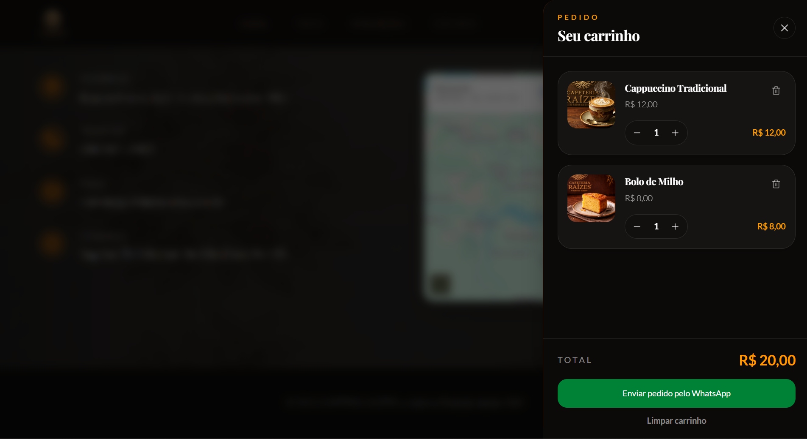

# ☕ Cafeteria Colonial


Aplicação web desenvolvida para uma cafeteria de identidade colonial, com foco em **interface sofisticada**, **cardápio interativo**, **carrinho de pedidos**, **integração com WhatsApp**, **experiência do usuário**, **responsividade**, **organização de código** e **deploy em produção com Vercel**.

O projeto foi desenvolvido com **React**, **TypeScript**, **Vite** e **Tailwind CSS**, utilizando uma estrutura limpa, componentizada e preparada para evolução.

A aplicação apresenta uma landing page moderna para a **Cafeteria Raízes**, permitindo que o usuário visualize o menu, adicione produtos ao carrinho, controle quantidades e envie o pedido formatado diretamente pelo WhatsApp.

> **Observação sobre a identidade do projeto:**  
> O repositório utiliza o nome **Cafeteria Colonial** como nome do projeto, enquanto a interface apresenta a marca fictícia **Cafeteria Raízes**, criada para representar visualmente uma cafeteria artesanal com identidade própria.

---

## 🌐 Acesse o Projeto

👉 **Deploy:** [Cafeteria Colonial na Vercel](https://cafeteria-colonial-livid.vercel.app/)

👉 **Repositório:** [github.com/felipe-frc/cafeteria-colonial](https://github.com/felipe-frc/cafeteria-colonial)

> A aplicação está hospedada na Vercel como projeto front-end estático. O build de produção é gerado com Vite e publicado a partir da pasta `dist`.

Para executar localmente, siga as instruções da seção **Como Executar**.

---

## 📌 Objetivo do Projeto

Este projeto foi desenvolvido com o objetivo de praticar e demonstrar conhecimentos em:

- Desenvolvimento front-end moderno com React e TypeScript;
- Construção de landing pages responsivas;
- Organização de componentes por responsabilidade;
- Separação entre layout, seções, dados, hooks e utilitários;
- Manipulação de estado com carrinho de pedidos;
- Cálculo de totais e controle de quantidade;
- Integração com WhatsApp através de mensagem formatada;
- Estilização com Tailwind CSS;
- Integração de imagens, mapa e assets locais;
- Criação de interface com identidade visual própria;
- Aplicação de boas práticas de UX/UI;
- Configuração de build e deploy com Vite e Vercel;
- Limpeza estrutural de projeto e remoção de código morto;
- Documentação técnica para portfólio profissional.

---

## ⭐ Destaques Técnicos

- Projeto front-end puro com React, TypeScript, Vite e Tailwind CSS;
- Estrutura organizada em componentes de layout, seções, carrinho, dados, hooks e utilitários;
- Header fixo com navegação por âncoras e contador de itens no carrinho;
- Hero section com identidade visual forte e chamada principal;
- Seção institucional apresentando a essência da cafeteria;
- Cardápio interativo dividido entre **Bebidas** e **Quitandas**;
- Carrinho lateral com controle de quantidade;
- Cálculo automático do total do pedido;
- Envio do pedido pelo WhatsApp com mensagem formatada;
- Depoimentos de clientes em formato visual;
- Seção de localização com Google Maps incorporado;
- Background interno com imagem temática aplicada de forma sutil;
- Imagens e assets locais organizados no projeto;
- SEO básico configurado no `index.html`;
- Deploy configurado na Vercel com `vercel.json`;
- Build de produção gerado com Vite;
- Estrutura limpa, sem arquivos gerados, dependências desnecessárias ou código morto.

---

## 🧩 Funcionalidades

### 🏠 Página Inicial

- Apresentação visual da Cafeteria Raízes;
- Imagem principal com identidade da marca;
- Botão de chamada para reserva/contato;
- Navegação direta para as seções principais da página;
- Header fixo com acesso ao carrinho.

### ☕ Nossa Essência

- Seção institucional com apresentação da cafeteria;
- Texto descritivo sobre tradição, acolhimento e experiência artesanal;
- Indicadores visuais de anos de tradição, clientes felizes e qualidade;
- Imagem temática para reforçar a identidade visual.

### 🍵 Menu

- Cardápio dividido em categorias;
- Alternância entre **Bebidas** e **Quitandas**;
- Exibição de imagem, nome, descrição e preço dos produtos;
- Layout em cards responsivos;
- Botão **Adicionar** em cada produto;
- Hover visual nos cards para reforçar a ação de pedido.

### 🛒 Carrinho de Pedidos

- Adição de produtos ao carrinho;
- Abertura automática do carrinho após adicionar item;
- Contador de itens no header;
- Controle de quantidade por produto;
- Remoção individual de itens;
- Opção para limpar o carrinho;
- Cálculo automático do total;
- Visualização resumida do pedido antes do envio.

### 📲 Integração com WhatsApp

- Geração automática da mensagem do pedido;
- Inclusão de produtos, quantidades, valores e total;
- Envio do pedido para o WhatsApp da cafeteria;
- Fluxo pensado para retirada no local;
- Experiência simples e compatível com pequenos negócios.

### ⭐ Depoimentos

- Depoimentos de clientes;
- Exibição visual de estrelas;
- Cards com nome do cliente e comentário;
- Reforço de prova social para o negócio.

### 📍 Localização e Contato

- Informações de endereço;
- Telefone;
- E-mail;
- Horários de funcionamento;
- Mapa integrado com Google Maps;
- Seção preparada para contato e conversão do usuário.

---

## 🛠️ Tecnologias

| Camada / Finalidade     | Tecnologia                    |
| ----------------------- | ----------------------------- |
| Linguagem               | TypeScript                    |
| Biblioteca de Interface | React                         |
| Build Tool              | Vite                          |
| Estilização             | Tailwind CSS                  |
| Ícones                  | Lucide React                  |
| Componentização UI      | shadcn/ui — componente Button |
| Utilitários de classe   | clsx, tailwind-merge          |
| Deploy                  | Vercel                        |
| Configuração de Deploy  | vercel.json                   |
| Versionamento           | Git / GitHub                  |
| Formatação              | Prettier                      |

---

## 🧱 Arquitetura

O projeto utiliza uma estrutura front-end organizada por responsabilidade, separando componentes visuais, dados estáticos, hooks, utilitários, assets públicos e configurações de build/deploy.

```txt
cafeteria-colonial/
│
├── client/
│   ├── index.html
│   │
│   ├── public/
│   │   ├── images/
│   │   │   ├── background-home.png
│   │   │   ├── background-home.webp
│   │   │   ├── cafeteria-identidade.png
│   │   │   ├── logo-cafeteria.png
│   │   │   │
│   │   │   ├── menu/
│   │   │   │   ├── biscoito-de-polvilho.png
│   │   │   │   ├── bolo-de-chocolate.png
│   │   │   │   ├── bolo-de-milho.png
│   │   │   │   ├── broa-de-milho.png
│   │   │   │   ├── cafe-coado.png
│   │   │   │   ├── cafe-com-leite.png
│   │   │   │   ├── cafe-gelado.png
│   │   │   │   ├── cappuccino-tradicional.png
│   │   │   │   ├── croissant.png
│   │   │   │   ├── espresso-colonial.png
│   │   │   │   ├── macchiato-classico.png
│   │   │   │   └── pao-de-queijo.png
│   │   │   │
│   │   │   └── telas/
│   │   │       ├── carrinho.png
│   │   │       ├── depoimentos.png
│   │   │       ├── home.png
│   │   │       ├── interface.png
│   │   │       ├── menu-bebidas.png
│   │   │       ├── menu-quitandas.png
│   │   │       ├── nos-visite.png
│   │   │       └── sobre.png
│   │   │
│   │   └── video/
│   │       └── video-fundo.mp4
│   │
│   └── src/
│       ├── App.tsx
│       ├── main.tsx
│       ├── index.css
│       │
│       ├── components/
│       │   ├── ErrorBoundary.tsx
│       │   │
│       │   ├── cart/
│       │   │   └── CartDrawer.tsx
│       │   │
│       │   ├── layout/
│       │   │   ├── Footer.tsx
│       │   │   └── Header.tsx
│       │   │
│       │   ├── sections/
│       │   │   ├── AboutSection.tsx
│       │   │   ├── ContactSection.tsx
│       │   │   ├── HeroSection.tsx
│       │   │   ├── MenuSection.tsx
│       │   │   ├── ReviewsSection.tsx
│       │   │   └── SectionTitle.tsx
│       │   │
│       │   └── ui/
│       │       └── button.tsx
│       │
│       ├── data/
│       │   ├── contact.ts
│       │   ├── menu.ts
│       │   └── reviews.ts
│       │
│       ├── hooks/
│       │   └── useCart.ts
│       │
│       ├── lib/
│       │   └── utils.ts
│       │
│       ├── pages/
│       │   └── Home.tsx
│       │
│       └── utils/
│           ├── currency.ts
│           └── whatsapp.ts
│
├── .gitignore
├── .prettierignore
├── .prettierrc
├── components.json
├── LICENSE
├── package-lock.json
├── package.json
├── README.md
├── tsconfig.json
├── tsconfig.node.json
├── vercel.json
└── vite.config.ts
```

### 📂 Organização das Pastas

| Caminho                                   | Responsabilidade                                    |
| ----------------------------------------- | --------------------------------------------------- |
| `client/index.html`                       | Arquivo HTML principal usado pelo Vite              |
| `client/public/images`                    | Imagens públicas do projeto                         |
| `client/public/images/menu`               | Imagens dos produtos exibidos no cardápio           |
| `client/public/images/telas`              | Prints utilizados na documentação do README         |
| `client/public/video`                     | Vídeo utilizado como recurso visual da aplicação    |
| `client/src/components/ErrorBoundary.tsx` | Componente de proteção contra erros de renderização |
| `client/src/components/cart`              | Componentes relacionados ao carrinho de pedidos     |
| `client/src/components/layout`            | Componentes estruturais, como cabeçalho e rodapé    |
| `client/src/components/sections`          | Seções principais da landing page                   |
| `client/src/components/ui`                | Componentes reutilizáveis de interface              |
| `client/src/data`                         | Dados estáticos de contato, menu e depoimentos      |
| `client/src/hooks`                        | Hooks personalizados, como a lógica do carrinho     |
| `client/src/lib`                          | Funções auxiliares compartilhadas                   |
| `client/src/pages`                        | Páginas da aplicação                                |
| `client/src/utils`                        | Utilitários para moeda e integração com WhatsApp    |
| `vercel.json`                             | Configuração de deploy na Vercel                    |
| `vite.config.ts`                          | Configuração do Vite                                |
| `tsconfig.json`                           | Configuração principal do TypeScript                |
| `tsconfig.node.json`                      | Configuração TypeScript para arquivos Node/Vite     |
| `components.json`                         | Configuração dos componentes de UI                  |

### 🔄 Fluxo Principal da Aplicação

```txt
main.tsx
   ↓
App.tsx
   ↓
Home.tsx
   ↓
Header
HeroSection
AboutSection
MenuSection
ReviewsSection
ContactSection
Footer
CartDrawer
```

### 🛒 Fluxo do Carrinho

```txt
MenuSection
   ↓
Adicionar produto
   ↓
useCart
   ↓
CartDrawer
   ↓
Gerar total do pedido
   ↓
whatsapp.ts
   ↓
Enviar pedido formatado pelo WhatsApp
```

### 🧩 Separação de Responsabilidades

- `MenuSection.tsx` exibe os produtos e aciona a adição ao carrinho;
- `useCart.ts` centraliza a lógica de adicionar, remover, alterar quantidade, limpar carrinho e calcular totais;
- `CartDrawer.tsx` exibe o carrinho lateral e as ações do pedido;
- `currency.ts` centraliza a formatação de valores monetários;
- `whatsapp.ts` monta o link e a mensagem formatada para envio do pedido;
- `menu.ts`, `reviews.ts` e `contact.ts` mantêm os dados separados da interface;
- `Header.tsx` concentra a navegação principal e o contador de itens do carrinho;
- `Home.tsx` organiza a composição geral da página;
- `ErrorBoundary.tsx` adiciona uma camada de segurança para falhas inesperadas na renderização.

### ⚠️ Observação sobre Arquivos Gerados

As pastas abaixo não fazem parte da arquitetura versionada do projeto e não devem ser enviadas para o GitHub:

```txt
node_modules/
dist/
.git/
```

- `node_modules/` é recriada com `npm install`;
- `dist/` é recriada com `npm run build`;
- `.git/` pertence ao controle interno do Git e não deve ser incluída em ZIPs do projeto.

---

## 📸 Interface do Sistema

### 📱 Interface Completa

Visão geral da landing page com hero, seção institucional, menu, carrinho, depoimentos e localização.


---

### 🏠 Página Inicial

Hero section com identidade visual da cafeteria, navegação superior e chamada para contato.


---

### ☕ Nossa Essência

Seção institucional com apresentação da tradição, proposta visual e indicadores da cafeteria.


---

### 🍵 Menu — Bebidas

Cardápio de bebidas com imagens, descrições, preços e botão para adicionar ao pedido.


---

### 🥐 Menu — Quitandas

Cardápio de quitandas com produtos visuais e organização por categoria.


---

### 🛒 Carrinho de Pedidos

Carrinho lateral com produtos adicionados, controle de quantidade, total e envio pelo WhatsApp.



---

### ⭐ Depoimentos

Depoimentos de clientes em cards com avaliação visual.


---

### 📍 Visite-nos

Seção com endereço, telefone, e-mail, horários e mapa incorporado.


---

## ⚙️ Como Executar

### 📋 Pré-requisitos

- [Node.js](https://nodejs.org/)
- [Git](https://git-scm.com/)
- Editor de código, como [VS Code](https://code.visualstudio.com/)

---

### 1. Clone o repositório

```bash
git clone https://github.com/felipe-frc/cafeteria-colonial.git
```

---

### 2. Acesse a pasta do projeto

```bash
cd cafeteria-colonial
```

---

### 3. Instale as dependências

```bash
npm install
```

---

### 4. Execute em ambiente de desenvolvimento

```bash
npm run dev
```

Acesse no navegador:

```txt
http://localhost:5173
```

---

### 5. Valide o TypeScript

```bash
npm run check
```

---

### 6. Gere o build de produção

```bash
npm run build
```

O Vite irá gerar a pasta:

```txt
dist/
```

---

### 7. Visualize o build localmente

```bash
npm run preview
```

---

## ✅ Qualidade e Organização

O projeto passou por uma limpeza estrutural para manter apenas arquivos, dependências e componentes realmente necessários.

Entre as melhorias aplicadas estão:

- Remoção de arquivos gerados localmente;
- Remoção de pastas desnecessárias para o funcionamento da aplicação;
- Simplificação da estrutura para front-end estático;
- Organização da Home em componentes menores;
- Separação dos dados do cardápio, contato e depoimentos;
- Separação da lógica de carrinho em hook dedicado;
- Separação da formatação de moeda em utilitário próprio;
- Separação da geração de mensagem do WhatsApp em utilitário próprio;
- Redução de dependências não utilizadas;
- Configuração de deploy com `vercel.json`;
- Padronização dos scripts no `package.json`;
- Atualização da documentação do projeto.

Scripts disponíveis:

| Comando           | Descrição                                        |
| ----------------- | ------------------------------------------------ |
| `npm run dev`     | Executa o projeto em ambiente de desenvolvimento |
| `npm run build`   | Gera o build de produção com Vite                |
| `npm run preview` | Visualiza localmente o build gerado              |
| `npm run check`   | Executa verificação TypeScript                   |
| `npm run format`  | Formata os arquivos com Prettier                 |

---

## 🧠 Decisões de Desenvolvimento

### Projeto front-end estático

A aplicação foi mantida como front-end puro, sem backend próprio, porque o objetivo do projeto é apresentar uma experiência institucional e comercial leve, focada em interface, cardápio, pedido e contato direto.

Essa decisão simplifica o deploy, reduz complexidade e torna o projeto mais direto para avaliação em portfólio.

### Carrinho sem backend

O carrinho foi implementado no front-end para permitir que o usuário monte um pedido de forma simples, sem necessidade de banco de dados, autenticação ou painel administrativo.

Essa abordagem é adequada para pequenos negócios que recebem pedidos diretamente por WhatsApp.

### Integração com WhatsApp

A integração com WhatsApp foi escolhida por ser uma solução prática e comum para cafeterias, lanchonetes e pequenos comércios.

O sistema monta uma mensagem com os produtos, quantidades, valores e total, permitindo que o cliente envie o pedido de maneira rápida.

### Componentização por responsabilidade

A interface foi separada em componentes de layout, seções e carrinho.

Essa organização evita que toda a página fique concentrada em um único arquivo e facilita futuras melhorias, como adicionar novas seções, alterar o cardápio ou evoluir o fluxo de pedidos.

### Separação de dados e interface

Os dados do menu, contato e depoimentos ficam separados da estrutura visual.

Isso torna o código mais limpo, melhora a manutenção e permite atualizar produtos, valores, depoimentos ou telefone do WhatsApp sem alterar diretamente os componentes principais da interface.

### Hooks e utilitários

A lógica do carrinho foi isolada em um hook dedicado, enquanto a formatação de moeda e a montagem do link do WhatsApp foram separadas em utilitários.

Essa separação melhora a legibilidade, reduz duplicação e facilita futuras alterações.

### Tailwind CSS para estilização

O Tailwind CSS foi utilizado para construir uma interface responsiva e consistente, com controle direto sobre espaçamentos, cores, tipografia e comportamento visual.

### Vercel como plataforma de deploy

A Vercel foi escolhida por ser adequada para aplicações front-end modernas com Vite, oferecendo build automático a cada push na branch principal.

O arquivo `vercel.json` define o diretório de saída como `dist`, garantindo que o deploy utilize corretamente o build gerado pelo Vite.

---

## 📦 Releases

### [v3.0.0 — Carrinho de pedidos e integração com WhatsApp](https://github.com/felipe-frc/cafeteria-colonial/releases/tag/v3.0.0)

Versão principal do projeto, transformando a landing page institucional em uma experiência interativa de pedidos com carrinho e envio direto pelo WhatsApp.

Principais melhorias:

- Adicionado carrinho de pedidos;
- Adicionado botão **Adicionar** nos produtos do menu;
- Implementado controle de quantidade dos itens;
- Implementada remoção individual de produtos;
- Adicionada opção para limpar o carrinho;
- Implementado cálculo automático do total do pedido;
- Adicionado envio do pedido pelo WhatsApp com mensagem formatada;
- Adicionado contador de itens no carrinho;
- Ajustado espaçamento interno dos cards do menu;
- Corrigido posicionamento de preço e botão dentro dos cards;
- Atualizada a imagem do produto **Macchiato Clássico**;
- Mantida a estrutura limpa, componentizada e preparada para evolução.

### [v2.1.0 — Limpeza estrutural e melhorias de layout](https://github.com/felipe-frc/cafeteria-colonial/releases/tag/v2.1.0)

Versão focada na limpeza estrutural do projeto, remoção de arquivos desnecessários, organização da base de código e refinamentos visuais após a reestruturação da landing page.

Principais melhorias:

- Reorganização da estrutura do projeto;
- Remoção de arquivos gerados e pastas desnecessárias;
- Simplificação da aplicação como front-end React + Vite;
- Remoção de código morto e dependências não utilizadas;
- Separação da interface em componentes de layout, seções e dados;
- Aplicação do background `background-home` nas seções internas;
- Correção visual da seção **Nossa Essência**;
- Ajuste de contraste no botão **Reservar**;
- Correção da configuração de deploy na Vercel;
- Adição do arquivo `vercel.json`;
- Atualização da documentação do projeto.

### [v2.0.0 — Rebranding e Reestruturação](https://github.com/felipe-frc/cafeteria-colonial/releases/tag/v2.0.0)

Nova versão principal do projeto, com reformulação visual e estrutural da landing page da cafeteria.

Principais melhorias:

- Reformulação significativa da interface;
- Reorganização da estrutura do projeto;
- Atualização da identidade visual;
- Substituição de assets externos por arquivos locais;
- Cardápio interativo com categorias;
- Seção institucional;
- Mapa integrado na seção de contato;
- Favicon com a logo do projeto;

### [v1.0.1 — Atualização de estabilidade e documentação](https://github.com/felipe-frc/cafeteria-colonial/releases/tag/v.1.0.1)

Atualização do projeto com foco em estabilidade, organização e melhoria da documentação.

Principais melhorias:

- Correção da estrutura inicial do projeto;
- Ajustes nas configurações de build;
- Estabilização de dependências;
- Melhoria na organização do código;
- Atualização do README;
- Preparação do projeto para deploy e evolução contínua.

> Observação: esta versão utilizou a tag `v.1.0.1`. Nas próximas versões, o padrão recomendado é manter tags no formato `v1.0.1`, sem ponto após o `v`.

### [v1.0.0 — Primeira versão estável](https://github.com/felipe-frc/cafeteria-colonial/releases/tag/v1.0.0)

Primeira versão oficial do projeto Cafeteria Colonial.

Principais entregas:

- Layout institucional completo da cafeteria;
- Hero section com identidade visual;
- Proposta visual colonial sofisticada;
- Menu dividido entre bebidas e alimentos;
- Seção de depoimentos;
- Seção de localização com mapa incorporado;
- Footer com informações de contato;
- Organização inicial do projeto para portfólio.

---

## 📈 Melhorias Futuras

- Formulário de contato funcional;
- Seleção entre retirada no local e entrega;
- Campo de observações no carrinho;
- Validação de pedido mínimo;
- Persistência do carrinho com `localStorage`;
- Testes automatizados com Vitest e Testing Library;
- Melhorias de acessibilidade;
- Animações sutis entre seções;
- Galeria de fotos do ambiente e produtos;
- Domínio personalizado;
- Área administrativa para gerenciar o cardápio.

---

## 📄 Licença

Este projeto está sob a licença MIT. Veja o arquivo [LICENSE](LICENSE) para mais detalhes.

---

## 👨🏻‍💻 Autor

**Marcos Felipe França**

[LinkedIn](https://www.linkedin.com/in/marcosfelipefrc) · [GitHub](https://github.com/felipe-frc)
